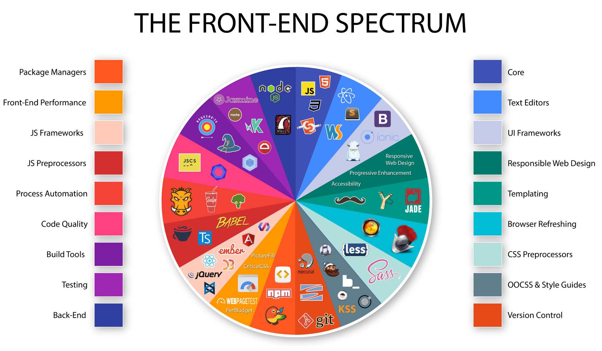

<section style="text-align: right; display: flex !important; justify-content: flex-end">
    <h2 class="fragment fade-down">Hai să vorbim puțin despre Frontend și Web Dev</h2>
    
cu Tudor

    
UBB edition

</section>
<section data-menu-title="Ce-i Frontendu' ăsta?">
    
		
        <q>Tudor, da' ce-s alea Frontend și Web Dev?</q>   
        
    

</section>
<section data-background-image="images/fe-be.png" data-background-size="initial" data-background-repeat="no-repeat"></section>
<section>
    Bun, bun ... și care-s tehnologiile de bază?
</section>
<section data-background-image="images/html-css-js.png" data-background-size="initial" data-background-repeat="no-repeat"></section>
<section>
    Ok, de astea știam. Vrei să zici că nu-s destule?	
</section>
<section>
    
Nope.

    
    
</section>
<section data-menu-title="Calitate, nu cantitate">
    Să nu cumva să credeți că trebuie să știți tot ce-i acolo, că nici eu nu știu
</section>
<section data-menu-title="Săracul, e subestimat">Anyway, Frontend-ul ăsta e cam subestimat. De ce?</section>
<section data-menu-title="Trebuie băgat în seamă, serios">Și de ce nu ar trebui să fie?</section>
<section data-menu-title="Trebuie băgat în seamă, serios">Backend people ar spune că important e să meargă, nu cum arată ... well</section>
<section data-menu-title="Website 1" data-background-iframe="http://www.pnwx.com/" data-background-interactive></section>
<section data-menu-title="Save the best for last, nu?">Ce e mai bun, e mereu la final, nu?</section>
<section data-menu-title="Website 2" data-background-iframe="http://arngren.net/" data-background-interactive></section>

<section data-menu-title="Fonts matter" data-background-image="images/fontsmatter.jpg" data-background-size="initial" data-background-repeat="no-repeat"></section>

<section data-menu-title="JS vs TS">Hmm, fair enough so far, dar totuși, se tot aude de TypeScript ăsta și cum că ar bate JavaScript-ul.  Care e faza?</section>
<section data-menu-title="TS, pofta inimii" data-background-image="images/ts-vs-js-meme-1.png" data-background-size="initial" data-background-repeat="no-repeat"></section>

<section data-menu-title="Prepare to fight!">
    <pre>
        <code data-trim data-line-numbers style="font-size: 16px; line-height: 1.2em">
            const js = { 
                argument: 'I am shorter!',
                mainAdvantage: 'Directly understandable by the Browser; faster'
            };
            const ts = { 
                argument: 'I am safer!',
                mainAdvantage: 'Much less prone to bugs'
            };
            function fight(fighter1, fighter2) { 
                console.log("Is JavaScript's argument valid? " + js.argument.includes('shorter'));
                console.log("Is TypeScript's argument valid? " + ts.argument.includes('safer'));
                console.log("Can they really be compared? " + js.mainAdvantage === ts.mainAdvantage);
            }
            fight(js, ts);
        </code>
    </pre>
</section>

<section data-menu-title="De ce TypeScript?" data-background-image="images/ts-vs-js-meme-2.png" data-background-size="initial" data-background-repeat="no-repeat"></section>
<section data-menu-title="Băgăm cod" data-background-image="images/coding.png" data-background-size="initial" data-background-repeat="no-repeat"></section>
			
<section data-background-transition="zoom" data-menu-title="Questions?" data-background-image="images/questions.jpg" data-background-size="60% 60%" data-background-repeat="no-repeat"></section>
<section data-menu-title="Pentru pasionați">
    
Ce am folosit?

    <ul>
        <li class="fragment fade-down">IDE: Visual Studio Code (XCode Theme)</li>
        <li class="fragment fade-down">IDE Font: Fira Code</li>
        <li class="fragment fade-down">IDE Plugins: Tabnine & Emmet (Autocompletion), Prettier (Formatter)</li>
        <li class="fragment fade-down">Presentation Framework: reveal-md (Reveal.js)</li>
    </ul>
</section>
<section data-menu-title="Feedback">
    As always, any feedback counts!
    
					
        
        
    

</section>
